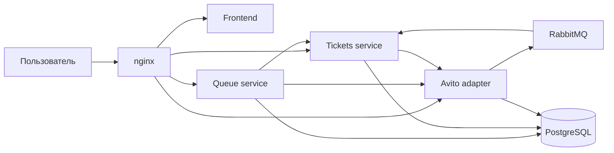

# Queue — очередь на лимитированные товары

Проект команды хакатона Авито «Лаборатория Кода». Решение добавляет к карточке лимитированного товара FIFO-очередь и выдаёт дошедшему до начала очереди ограниченное по времени право на покупку — тикет.

Пользователь может встать в независимые очереди разных товаров, следить за своим местом на экране «Мои очереди», выйти из очереди, активировать полученный тикет или отказаться от него. Если свободная единица товара есть и перед пользователем никого нет, тикет выдаётся сразу. Активация тикета запускает mock стандартного checkout-flow Авито.

## Запуск

Для запуска нужны Docker с плагином Docker Compose и свободные порты `80`, `5672` и `15672`.

В корне репозитория уже находится `.env` с настройками локального окружения. Чтобы поднять все сервисы, базы, миграции и брокер, выполните:

```bash
docker compose up -d --build
```

После прохождения healthcheck приложение доступно по адресу [http://localhost](http://localhost). RabbitMQ Management UI доступен на [http://localhost:15672](http://localhost:15672).

Проверить состояние контейнеров и посмотреть логи можно командами:

```bash
docker compose ps
docker compose logs -f
```

Остановить приложение:

```bash
docker compose down
```

Данные PostgreSQL и RabbitMQ сохраняются в Docker volumes. Для полного сброса локальных данных используйте `docker compose down -v`.

Корневой `Makefile` содержит короткие команды для основных операций:

```bash
make up          # запустить compose-стек
make down        # остановить compose-стек
make generate    # перегенерировать Go-код из контрактов
make lint        # проверить backend и frontend линтерами
make test        # запустить тесты backend-сервисов
make build       # собрать все сервисы
```

Frontend-тесты запускаются отдельно:

```bash
cd services/frontend
npm ci
npm test
```

## Архитектура

Решение состоит из четырёх прикладных сервисов и reverse proxy:



| Компонент | Ответственность |
| --- | --- |
| `frontend` | Каталог, карточка товара, постановка в очередь, экран «Мои очереди», работа с тикетом и демонстрационный checkout. |
| `queue` | FIFO-очереди по товарам, уникальность участия пользователя, вычисление позиции, выход из очереди и запрос выдачи тикета. |
| `tickets` | Выдача и жизненный цикл тикетов, таймер активации, отказ, активация и переход к созданию заказа. |
| `avito-adapter` | Mock существующих сервисов Авито: пользователи, объявления, остатки, авторизация, заказы и оплата. |
| `nginx` | Единая точка входа и маршрутизация запросов между frontend и backend-сервисами. |

Синхронное взаимодействие сервисов построено на REST API. Изменения количества и статуса объявления доставляются асинхронно через RabbitMQ.

## Используемые технологии

### Backend и интеграции

- Go, Gin;
- PostgreSQL, `pgx`, SQLC и Goose;
- RabbitMQ и `amqp091-go`;
- OpenAPI, `oapi-codegen` и middleware-валидация запросов;
- AsyncAPI и `go-asyncapi` для контрактов событий;
- transactional outbox, publisher confirms и inbox;
- Testify и Testcontainers;
- `golangci-lint` и Redocly CLI.

### Frontend

- React 19 и TypeScript;
- Vite;
- Redux Toolkit и React Redux;
- React Router;
- Axios;
- Vitest и Testing Library;
- ESLint.

### Инфраструктура

- Docker и Docker Compose;
- nginx;
- GitHub Actions.

## Структура проекта

```text
.
├── .docker/                     # init-скрипты PostgreSQL и образ Goose
├── .github/workflows/           # CI для отдельных сервисов
├── schemas/services/            # клиентские OpenAPI- и AsyncAPI-контракты
├── services/
│   ├── frontend/                # React-приложение
│   ├── queue/                   # сервис очередей
│   ├── tickets/                 # сервис тикетов
│   └── avito-adapter/           # mock сервисов Авито
├── docker-compose.yaml          # локальный запуск всего решения
├── nginx.conf                   # маршрутизация внешнего API
└── Makefile                     # генерация, проверки, тесты и сборка
```

Backend-сервисы следуют единой структуре:

```text
cmd/app/                         # точка входа
config/                          # конфигурация из переменных окружения
docs/api/                        # серверный OpenAPI-контракт
docs/events/                     # AsyncAPI-контракт сервиса
gen/                             # сгенерированный код
internal/domain/                 # бизнес-модели и инварианты
internal/usecase/                # пользовательские сценарии
infrastructure/                  # HTTP, PostgreSQL, RabbitMQ и внешние клиенты
postgresql/migrations/           # миграции базы данных
build/Dockerfile                 # сборка контейнера
```

## Особенности реализации

- Очереди разделены по товарам и работают по FIFO. Позиция определяется временем создания записи на сервере.
- Пользователь может состоять только в одной очереди конкретного товара, но одновременно участвовать в очередях разных товаров.
- Выход из очереди удаляет текущую позицию; повторное вступление возможно только в конец.
- Если пользователь первый и свободный остаток позволяет выдать право на покупку, очередь не создаёт лишнего ожидания и запрашивает тикет сразу.
- Один действующий тикет закрепляет за пользователем одну доступную единицу. Выдача сериализована транзакционной advisory-блокировкой по объявлению, поэтому параллельные запросы не создают больше прав, чем позволяет остаток.
- Тикет имеет TTL только на активацию. После активации создаётся заказ, и дальнейший жизненный цикл относится к стандартному flow резервирования и оплаты.
- Изменения объявления публикуются в durable topic exchange `domain.events`. Tickets подписывается только на нужные routing keys и отзывает права при изменении остатка или статуса товара.
- Исходящие бизнес-события публикуются через transactional outbox и publisher confirms, входящие обрабатываются идемпотентно через inbox.
- API разрабатывается contract-first: strict Gin-серверы и клиенты генерируются из OpenAPI, а запросы проверяются middleware по контракту.
- Все пользовательские запросы используют opaque Bearer-токен. Backend преобразует его в `user_id` через Avito adapter и не доверяет идентификатору пользователя из клиента.
- Для демонстрации frontend автоматически создаёт тестового покупателя, восстанавливает состояние очередей и тикетов после перезагрузки и обновляет их polling-запросами.
- PostgreSQL разделён на отдельные базы сервисов; миграции автоматически применяются контейнером Goose до запуска приложений.
- Контейнеры имеют healthcheck, а Go-сервисы поддерживают graceful shutdown.

## Контракты и генерация кода

Публичные копии контрактов находятся в `schemas/services/<service>`, серверные — в `services/<service>/docs`. После изменения контракта нужно синхронизировать обе копии и выполнить:

```bash
make generate
```

Сгенерированные файлы в `gen/` вручную не редактируются.

## Команда

| Участник | Зона ответственности |
| --- | --- |
| `Georgii Loginov` | Tickets service, событийная интеграция, CI/CD, архитектура проекта, архитекутура репозитория и инфраструктура проекта |
| `ivan` | Frontend и интеграция пользовательских сценариев. |
| `DavidGinovyan25` | Queue service и авторизация. |
| `alexander` | Avito adapter. |

## Лицензия

Проект распространяется на условиях, указанных в файле [LICENSE](LICENSE).
